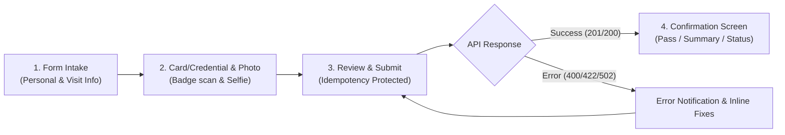

# Visitor Registration UI - Frontend Requirements Specification

## 1. Executive Summary

This document defines the functional, UX/UI, and integration requirements for the **Visitor Registration Form UI**. This standalone frontend application allows visitors or front-desk staff to submit registration details. Upon submission, it sends data directly to the Visitor Middleware Service (`POST /api/v1/visitors/reserve`), which orchestrates dual-instance registration with the Nuveq Access Control System.

---

## 2. System Architecture & Boundaries

```
[ Visitor Registration UI (Web/Tablet) ]
                |
                |  POST /api/v1/visitors/reserve (JSON)
                v
[ Visitor Middleware Service (Port 8080) ]
       |                         |
       v                         v
[ PostgreSQL 16 ]     [ Nuveq Partner API v2 ]
```

* **Frontend Scope**: Form intake, field validation, client-side idempotency key generation, photo capture/upload, user confirmation view, error banners.
* **Backend Scope**: Validation, idempotency enforcement, dual-instance creation (`CHECK_IN` and `CHECK_OUT`), Nuveq cloud sync, and card swipe state management.

---

## 3. User Journey & Wireframe Flow



---

## 4. Form Field Specifications

| Field Name | JSON Key | Type | UI Component | Required | Validation Rules / Notes |
|---|---|---|---|---|---|
| **Registration ID** | `registrationId` | String | Hidden / Auto-generated | **Yes** | UUID v4 or formatted ID (e.g. `REG-YYYYMMDD-XXXXXX`). Generated once when form opens. |
| **Full Name** | `fullName` | String | Text Input | **Yes** | 1 to 255 chars. Trim whitespace. |
| **Email Address** | `email` | String | Email Input | No | Standard email format (`user@domain.com`). |
| **Phone Number** | `phone` | String | Tel Input | No | E.164 or national format (e.g. `+6281234567890`). |
| **Vehicle Plate** | `vehicleNumber` | String | Text Input | No | Max 50 chars (e.g. `B 1234 XYZ`). Capitalize automatically. |
| **User Photo** | `userPhoto` | String (URL) | File Upload / Web Camera | No | Hosted image URL or cloud storage URL. |
| **Visit Start** | `visitStart` | String (ISO-8601) | Date-Time Picker | **Yes** | Must include timezone offset (e.g. `2026-10-02T08:00:00+07:00`). Cannot be in past. |
| **Visit End** | `visitEnd` | String (ISO-8601) | Date-Time Picker | **Yes** | Must be after `visitStart` (e.g. `2026-10-02T17:00:00+07:00`). |
| **Access Card Number**| `cardNumber` | String | Text / RFID Scanner | **Yes** | Numeric card number (e.g. `1253646425`). Supports barcode/NFC scanner input. |
| **Site** | `siteId` | Number (Long) | Select Dropdown | **Yes** | Selected from active sites (Default: `167` - "Jakarta meruya"). |
| **Lift Group** | `liftGroupId` | Number (Long) | Select Dropdown | **Yes** | Selected from active lift groups (Default: `630` - "Full Access"). |
| **Allowed Doors** | `allowedDoorIds` | Array[Number] | Multi-select Checkboxes | **Yes** | At least 1 door selected (e.g. `[2596, 4904]`). |

---

## 5. API Specification: Reserve Endpoint

### Request
* **Method**: `POST`
* **URL**: `http://<domain-or-ip>:8080/api/v1/visitors/reserve`
* **Content-Type**: `application/json`

#### Complete Request Payload Example
```json
{
  "registrationId": "REG-20261002-8921",
  "fullName": "Jane Doe",
  "email": "jane.doe@example.com",
  "phone": "+6281234567890",
  "userPhoto": "https://storage.googleapis.com/nuveq_live_storage/user_photos/example.jpg",
  "vehicleNumber": "B 1234 XYZ",
  "visitStart": "2026-10-02T08:00:00+07:00",
  "visitEnd": "2026-10-02T17:00:00+07:00",
  "siteId": 167,
  "liftGroupId": 630,
  "allowedDoorIds": [2596, 4904],
  "cardNumber": "1253646425"
}
```

---

### Response Schemas

#### 1. Success Response (201 Created or 200 OK)
Returned when a new registration is successfully processed or when an existing registration is returned (idempotency):

```json
{
  "timestamp": "2026-10-02T04:37:13.394Z",
  "success": true,
  "message": "Visitor reservation created successfully",
  "data": {
    "registrationId": "REG-20261002-8921",
    "idempotent": false,
    "checkIn": {
      "id": "5d2f9dd1-5d7c-4569-8ab6-ab4f1404fc91",
      "registrationId": "REG-20261002-8921",
      "userType": "CHECK_IN",
      "fullName": "Jane Doe",
      "email": "jane.doe@example.com",
      "phone": "+6281234567890",
      "userPhoto": "https://storage.googleapis.com/nuveq_live_storage/user_photos/example.jpg",
      "vehicleNumber": "B 1234 XYZ",
      "visitStart": "2026-10-02T08:00:00+07:00",
      "visitEnd": "2026-10-02T17:00:00+07:00",
      "siteId": 167,
      "liftGroupId": 630,
      "allowedDoorIds": [2596, 4904],
      "cardNumber": "1253646425",
      "nuveqVisitorId": "104990",
      "nuveqRegistrationId": "189727",
      "statusEntry": false,
      "createdAt": "2026-10-02T04:37:12+07:00",
      "updatedAt": "2026-10-02T04:37:12+07:00"
    },
    "checkOut": {
      "id": "c0cd9557-ecef-420f-81e8-6c3eb353ff0b",
      "registrationId": "REG-20261002-8921",
      "userType": "CHECK_OUT",
      "fullName": "Jane Doe",
      "email": "jane.doe@example.com",
      "phone": "+6281234567890",
      "userPhoto": "https://storage.googleapis.com/nuveq_live_storage/user_photos/example.jpg",
      "vehicleNumber": "B 1234 XYZ",
      "visitStart": "2026-10-02T08:00:00+07:00",
      "visitEnd": "2026-10-02T17:00:00+07:00",
      "siteId": 167,
      "liftGroupId": 630,
      "allowedDoorIds": [2596, 4904],
      "cardNumber": "1253646425",
      "nuveqVisitorId": "104991",
      "nuveqRegistrationId": "189728",
      "statusEntry": false,
      "createdAt": "2026-10-02T04:37:12+07:00",
      "updatedAt": "2026-10-02T04:37:12+07:00"
    }
  }
}
```

---

#### 2. Validation Error (400 Bad Request)
Returned when required inputs are missing or invalid:

```json
{
  "timestamp": "2026-10-02T04:35:40.123Z",
  "status": 400,
  "error": "Bad Request",
  "message": "Validation failed for input data",
  "path": "/api/v1/visitors/reserve",
  "details": [
    {
      "field": "fullName",
      "rejectedValue": "",
      "message": "fullName is required"
    },
    {
      "field": "email",
      "rejectedValue": "invalid-email",
      "message": "Invalid email format"
    },
    {
      "field": "allowedDoorIds",
      "rejectedValue": null,
      "message": "allowedDoorIds cannot be empty"
    }
  ]
}
```

* **UI Action**: Display field-level red error messages under the corresponding input controls matching `field`.

---

#### 3. Nuveq Upstream Error (422 Unprocessable Entity)
Returned when Nuveq Access Control rejects parameter values (e.g. invalid site or invalid date format):

```json
{
  "timestamp": "2026-10-02T04:35:40.123Z",
  "status": 422,
  "error": "Unprocessable Entity",
  "message": "Nuveq API rejected request: ...",
  "path": "/api/v1/visitors/reserve"
}
```

* **UI Action**: Display an alert banner at the top of the form with the server message.

---

#### 4. Service Unavailable / Gateway Error (502 Bad Gateway)
Returned when Nuveq Cloud API is experiencing downtime or timed out after 3 retries:

```json
{
  "timestamp": "2026-10-02T04:35:40.123Z",
  "status": 502,
  "error": "Bad Gateway",
  "message": "Upstream Nuveq service unavailable or timed out",
  "path": "/api/v1/visitors/reserve"
}
```

* **UI Action**: Show a retry modal/toast: *"Access control service is temporarily unreachable. Please try again in a few moments."*

---

## 6. Frontend State & UX Requirements

### 6.1 Idempotency Key Handling
1. Generate a UUID or unique registration ID (`crypto.randomUUID()`) when the user loads or resets the registration form.
2. Store it in component state as `registrationId`.
3. If the user clicks "Submit" and a network timeout occurs, re-submitting uses the **same** `registrationId`. The backend guarantees no duplicate records will be created.
4. Only generate a **new** `registrationId` after the user explicitly clicks "Register Another Visitor" or resets the form.

### 6.2 Button State & Submission Lock
* Disable the "Submit" button and display a loading spinner as soon as the user clicks submit.
* Prevent accidental double-clicking or rapid resubmissions.

### 6.3 Date & Time Format
* Always format `visitStart` and `visitEnd` with timezone offset: `YYYY-MM-DDTHH:mm:ss±HH:mm`.
* Example: `2026-10-02T08:00:00+07:00`.

### 6.4 Confirmation Screen
Upon successful response:
* Display **Visitor Badge / Pass Card**:
  * Visitor Name: `Jane Doe`
  * Registration ID: `REG-20261002-8921`
  * Active Doors: Count or names (e.g. "Demo Door 1, 5601 Door1")
  * Visit Window: `08:00 - 17:00, 02 Oct 2026`
  * Access Card: `****6425`
  * Check-In Status: `Pending Entrance` (changes to `Entered` once scanned at turnstile)
* Provide a button: **"Register Another Visitor"** (resets form and creates new `registrationId`).

---

## 7. Reference Tenant Configuration Values

Use these pre-verified IDs for defaults or dropdown options:

### Site
* **ID**: `167`
* **Name**: Jakarta meruya

### Pre-configured Doors
| Door ID | Door Name |
|---|---|
| `2596` | Demo Door 1 |
| `3509` | Lift A |
| `3523` | Rack A |
| `4904` | 5601 Door1 |

### Lift Groups
| Lift Group ID | Description |
|---|---|
| `630` | Full Access (Recommended) |
| `1482` | FL 1 |
| `1483` | FL3-5-7 |
| `629` | No Access |

---

## 8. Recommended Frontend Tech Stack
* **Framework**: React 18+ (Next.js or Vite) or Vue 3
* **Form Management**: React Hook Form + Zod (for declarative schema validation)
* **Styling**: Tailwind CSS + shadcn/ui components
* **HTTP Client**: Axios or native `fetch` with error interceptor
