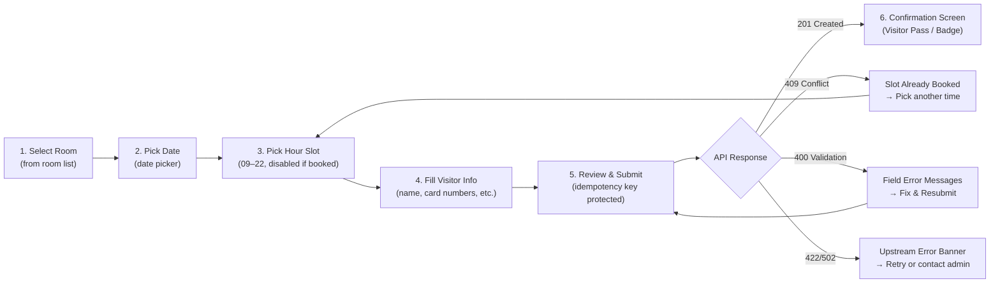

# Visitor Registration UI — Frontend Requirements Specification
**Last Updated**: 2026-10-03  
**Status**: ✅ UPDATED — Time-slot booking model incorporated

---

## 1. Executive Summary

This document defines the functional, UX/UI, and integration requirements for the **Visitor Registration Form UI** (`vms-form`). This standalone frontend application allows visitors or front-desk staff to submit registration details. Upon submission, it sends data to the Visitor Middleware Service (`POST /api/visitors/registration`), which orchestrates time-slot booking + dual-instance visitor registration with the Nuveq Access Control System.

---

## 2. System Architecture & Boundaries

```
[ Visitor Registration UI (Web/Tablet) — vms-form ]
                |
                |  POST /api/visitors/registration (JSON)
                |  GET  /api/rooms/{id}/availability?date=YYYY-MM-DD
                |  GET  /api/rooms
                v
[ Visitor Middleware Service (Port 8080) — vms-myboga ]
       |                         |
       v                         v
[ PostgreSQL 16 ]     [ Nuveq Partner API v2 ]
                        (server-side only — client NEVER calls Nuveq)
```

**Frontend Scope**: Room selection, date picker, hour-slot picker, personal info, card credential input, photo capture/upload, user confirmation view, error banners.  
**Backend Scope**: Slot conflict validation, idempotency enforcement, dual-instance creation (CHECK_IN and CHECK_OUT), Nuveq cloud sync, expiry management, webhook event processing.

---

## 3. User Journey & Wireframe Flow



---

## 4. Form Field Specifications

| Field Name | JSON Key | Type | UI Component | Required | Validation Rules |
|---|---|---|---|---|---|
| **Registration ID** | `registrationId` | String | Hidden / Auto-generated | **Yes** | `REG-YYYYMMDD-XXXXXX`. Generated once on form open. |
| **Room** | `roomId` | Number | Select Dropdown | **Yes** | Fetched from `GET /api/rooms`. |
| **Visit Date** | *(UI only)* | Date | Date Picker | **Yes** | Today or future only. Triggers availability fetch. |
| **Visit Start Hour** | `visitStart` | ISO-8601 String | Hour Button Grid | **Yes** | From hour picker. Format: `2026-10-03T09:00:00+07:00`. |
| **Visit End Hour** | `visitEnd` | ISO-8601 String | Hour Button Grid | **Yes** | Must be > visitStart. Max 22:00. |
| **Full Name** | `fullName` | String | Text Input | **Yes** | 1–255 chars. |
| **Email Address** | `email` | String | Email Input | No | Standard email format. |
| **Phone Number** | `phone` | String | Tel Input | No | E.164 format (e.g. `+6281234567890`). |
| **Vehicle Plate** | `vehicleNumber` | String | Text Input | No | Max 50 chars. Auto-capitalize. |
| **User Photo** | `userPhoto` | String (URL) | File Upload / Web Camera | No | Hosted image URL. |
| **Check-In Card** | `cardNumber` | String | Text / RFID Scanner | **Yes** | Primary card for CHECK_IN. |
| **Check-Out Card** | `checkOutCardNumber` | String | Text / RFID Scanner | No | Optional distinct card for CHECK_OUT. Defaults to `cardNumber`. |
| **Site** | `siteId` | Number | Select Dropdown | **Yes** | Default: `167` (Jakarta meruya). |
| **Lift Group** | `liftGroupId` | Number | Select Dropdown | **Yes** | Default: `630` (Full Access). |

> `allowedDoorIds` is resolved automatically on the backend from `roomId → room.doors`. Client does not need to send it when `roomId` is provided.

---

## 5. Hour Slot Picker — UX Specification

### Behavior
1. User selects a **room** from dropdown
2. User selects a **date** from date picker
3. UI immediately calls: `GET /api/rooms/{roomId}/availability?date=YYYY-MM-DD`
4. Hour buttons render for **09 AM → 10 PM** (13 buttons total):
   - **Green / enabled**: Available — clickable
   - **Gray / disabled**: Already booked — shows tooltip `"Already booked"`
   - **Blue / selected**: User's current selection (range highlight)
5. User clicks first available hour = **start**, second = **end** (exclusive)
6. Selection is shown as: `"09:00 – 11:00 (2 hours)"`

### Hour Button Grid Example
```
[  9 AM ✓ ] [ 10 AM ✗ ] [ 11 AM ✗ ] [ 12 PM ✓ ] [ 1 PM ✓ ]
[ 2 PM ✓ ] [  3 PM ✓ ] [  4 PM ✓ ] [  5 PM ✓ ] [ 6 PM ✓ ]
[ 7 PM ✓ ] [  8 PM ✓ ] [  9 PM ✓ ] [ 10 PM (end cap, not selectable as start) ]
```

### visitStart / visitEnd Construction
```js
const visitStart = `${selectedDate}T${String(startHour).padStart(2,'0')}:00:00+07:00`;
const visitEnd   = `${selectedDate}T${String(endHour  ).padStart(2,'0')}:00:00+07:00`;
```

---

## 6. API Specification: Reserve Endpoint

### Request
- **Method**: `POST`
- **URL**: `/api/visitors/registration`
- **Content-Type**: `application/json`

#### Complete Request Payload Example
```json
{
  "registrationId": "REG-20261003-8921",
  "roomId": 5,
  "fullName": "Jane Doe",
  "email": "jane.doe@example.com",
  "phone": "+6281234567890",
  "userPhoto": "https://storage.googleapis.com/...",
  "vehicleNumber": "B 1234 XYZ",
  "visitStart": "2026-10-03T09:00:00+07:00",
  "visitEnd": "2026-10-03T11:00:00+07:00",
  "siteId": 167,
  "liftGroupId": 630,
  "cardNumber": "1253646425",
  "checkOutCardNumber": "1253646426"
}
```

---

### Response Schemas

#### 1. Success (201 Created or 200 OK — idempotent)
```json
{
  "timestamp": "2026-10-03T09:37:13.394Z",
  "success": true,
  "message": "Booking created successfully",
  "data": {
    "registrationId": "REG-20261003-8921",
    "idempotent": false,
    "roomId": 5,
    "roomName": "Meeting Room Alpha",
    "visitStart": "2026-10-03T09:00:00+07:00",
    "visitEnd": "2026-10-03T11:00:00+07:00",
    "bookingStatus": "PENDING",
    "visitorName": "Jane Doe",
    "cardNumberIn": "****6425",
    "cardNumberOut": "****6426",
    "allowedDoors": ["Demo Door 1", "5601 Door1"],
    "createdAt": "2026-10-03T09:37:12+07:00"
  }
}
```

#### 2. Slot Conflict (409 Conflict) — **NEW**
```json
{
  "timestamp": "2026-10-03T09:37:13.394Z",
  "status": 409,
  "error": "Conflict",
  "message": "Room is already booked for the selected time slot",
  "path": "/api/visitors/registration"
}
```
**UI Action**: Show alert banner. Highlight the hour picker. User must pick different hours.

#### 3. Validation Error (400 Bad Request)
```json
{
  "timestamp": "2026-10-03T09:35:40.123Z",
  "status": 400,
  "error": "Bad Request",
  "message": "Validation failed for input data",
  "details": [
    { "field": "visitStart", "message": "visitStart must be between 09:00 and 22:00" },
    { "field": "fullName",   "message": "fullName is required" }
  ]
}
```

#### 4. Nuveq Upstream Error (422)
```json
{
  "status": 422,
  "error": "Unprocessable Entity",
  "message": "Nuveq API rejected request: ..."
}
```

#### 5. Gateway Error (502)
```json
{
  "status": 502,
  "error": "Bad Gateway",
  "message": "Upstream Nuveq service unavailable or timed out"
}
```

---

## 7. Room Availability Endpoint

- **Method**: `GET`
- **URL**: `/api/rooms/{roomId}/availability?date=YYYY-MM-DD`

```json
{
  "success": true,
  "data": {
    "roomId": 5,
    "roomName": "Meeting Room Alpha",
    "date": "2026-10-03",
    "slots": [
      { "hour": 9,  "available": true },
      { "hour": 10, "available": false, "note": "Already booked" },
      { "hour": 11, "available": false, "note": "Already booked" },
      { "hour": 12, "available": true },
      { "hour": 13, "available": true },
      { "hour": 14, "available": true },
      { "hour": 15, "available": true },
      { "hour": 16, "available": true },
      { "hour": 17, "available": true },
      { "hour": 18, "available": true },
      { "hour": 19, "available": true },
      { "hour": 20, "available": true },
      { "hour": 21, "available": true }
    ]
  }
}
```

---

## 8. Frontend State & UX Requirements

### 8.1 Idempotency Key Handling
1. Generate `REG-YYYYMMDD-XXXXXX` when form loads
2. Reuse same key on network-timeout resubmit
3. Generate new key only after explicit reset / "Register Another"

### 8.2 Button State & Submission Lock
- Disable submit button + show spinner on first click
- Prevent double-submission

### 8.3 Date & Time Format
- Always include timezone: `YYYY-MM-DDTHH:mm:ss+07:00`
- Build from date picker + hour picker, not raw user text input

### 8.4 Confirmation Screen
Upon successful response:
- **Visitor Pass** showing:
  - Visitor Name
  - Registration ID
  - Room Name
  - Time Slot: `09:00 – 11:00, 03 Oct 2026`
  - Access Card: `****6425` (masked)
  - Status: `Pending Entrance` (shown as badge)
- Button: **"Register Another Visitor"** (resets form, new registrationId)

---

## 9. Room Master Management (Admin Panel)

### Endpoints
| Method | Path | Description |
|--------|------|-------------|
| `GET` | `/api/rooms` | List all rooms with doors |
| `POST` | `/api/rooms` | Create room |
| `PUT` | `/api/rooms/{id}` | Update room name and door mapping |
| `DELETE` | `/api/rooms/{id}` | Delete room |
| `GET` | `/api/rooms/doors` | List all Nuveq doors with mapping status |
| `POST` | `/api/rooms/sync` | Sync doors from Nuveq |

### List Rooms Response
```json
{
  "success": true,
  "data": [
    {
      "id": 5,
      "customName": "Meeting Room Alpha",
      "siteId": 167,
      "doors": [
        { "id": 3, "nuveqDoorId": 2596, "name": "Demo Door 1", "roomId": 5 },
        { "id": 7, "nuveqDoorId": 4904, "name": "5601 Door1",  "roomId": 5 }
      ]
    }
  ]
}
```

---

## 10. Reference Tenant Configuration Values

### Site
- **ID**: `167` · **Name**: Jakarta meruya

### Pre-configured Doors
| Door ID | Door Name | Zone |
|---------|-----------|------|
| `2596` | Demo Door 1 | Zone A - Lobby |
| `3509` | Lift A | Zone B - Elevator Bank |
| `3523` | Rack A | Zone C - Server Facility |
| `4904` | 5601 Door1 | Zone D - Executive Wing |

### Lift Groups
| Lift Group ID | Description |
|---------------|-------------|
| `630` | Full Access (Recommended) |
| `1482` | FL 1 |
| `1483` | FL3-5-7 |
| `629` | No Access |

---

## 11. Recommended Frontend Tech Stack
- **Framework**: Vanilla JS (current) or React 18 / Vue 3
- **Form Management**: React Hook Form + Zod (if migrating to React)
- **Styling**: Bootstrap 5 (current) or Tailwind CSS
- **HTTP Client**: Native `fetch` with error interceptors
